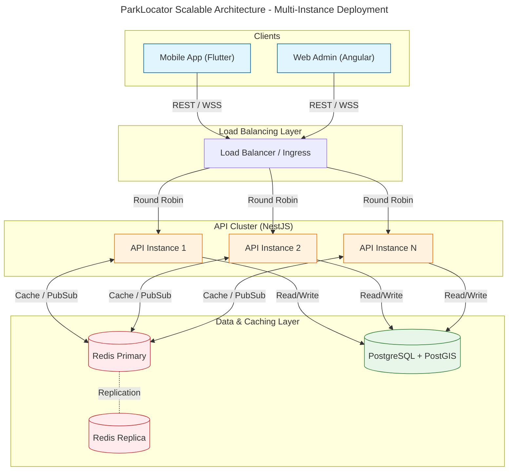
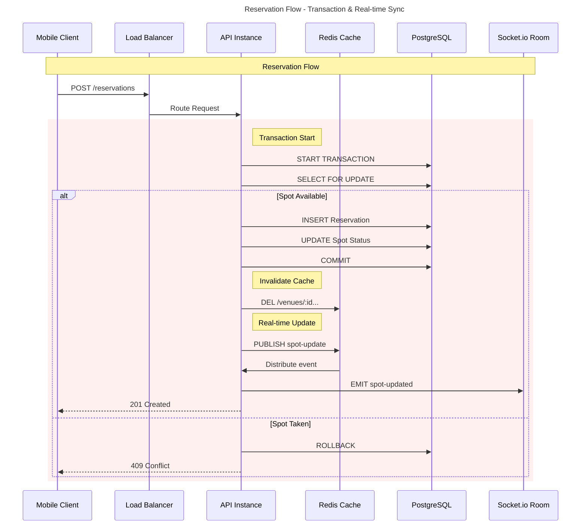
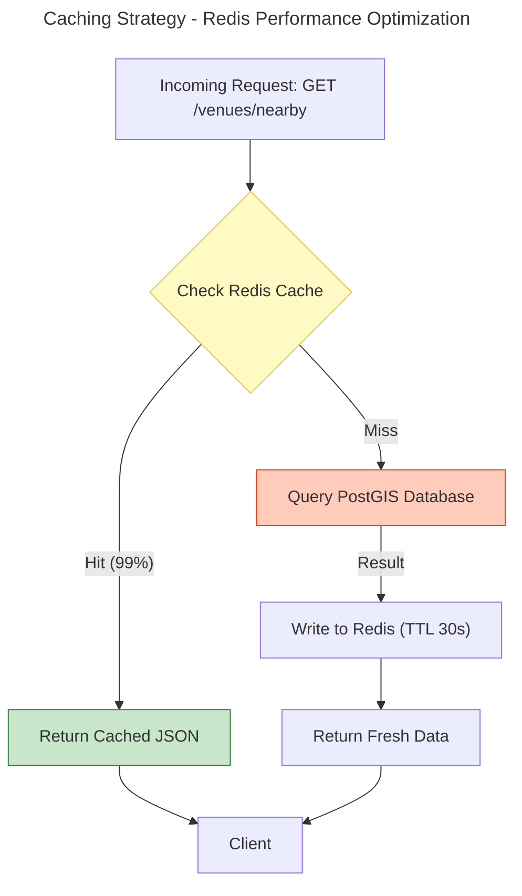
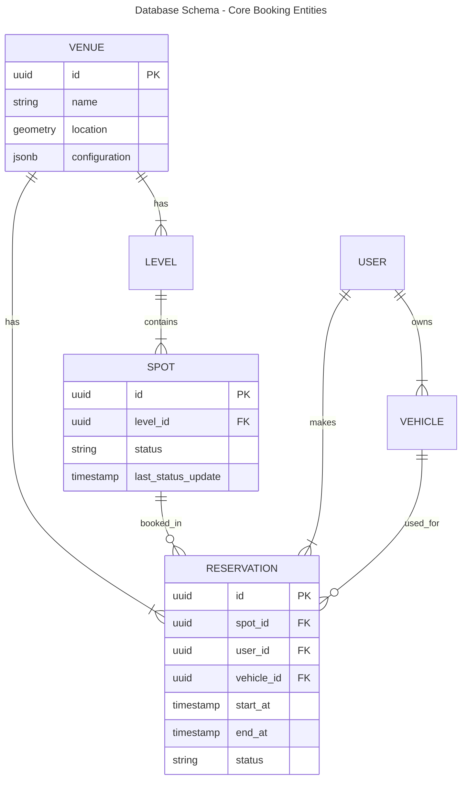

# System Scalability Architecture & Design

## High-Level Architecture
This diagram illustrates the fully scalable architecture of the ParkLocator system, featuring horizontal scaling, distributed caching, and real-time synchronization.

## Detailed Component Interaction
This view details the internal modules of the NestJS API and how they interact during a critical flow like a **Reservation**.

## Caching Strategy & Data Flow
How data flows through the caching layer to ensure high performance (2.75ms P95 latency).

## Database Schema (Scalability Focus)
Key entities involved in the high-concurrency booking system.

